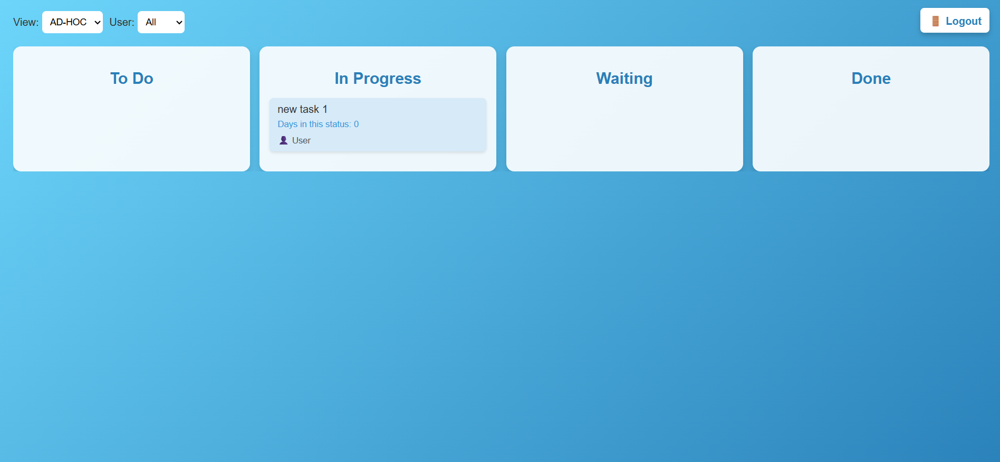
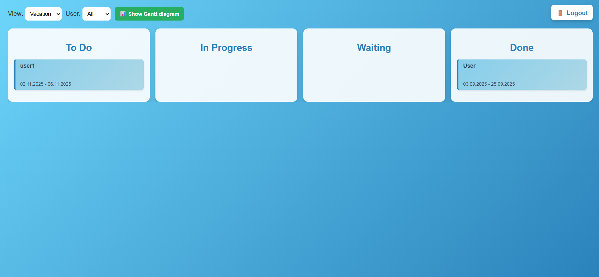
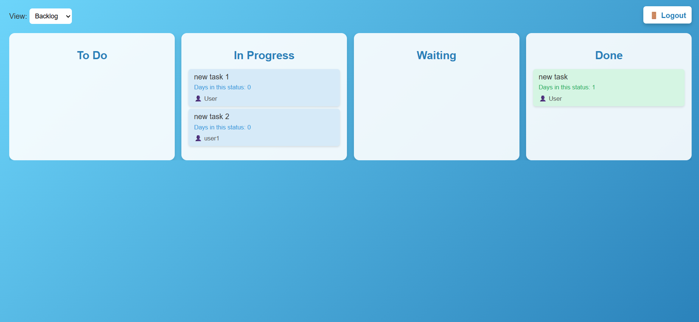

# Flask Kanban

A simple task kanban web application built with **Flask**, **SQLAlchemy**.  
The app allows user management, task management with a Kanban board, and basic authentication.

---

## Screenshots

- Login Page


- Kanban Board (Users)


- Kanban Board (AD-HOC). REG, PRO are similar



- Kanban Board (Vacation)



- Kanban Board (Backlog)



---

## Features

- User authentication (login/logout)
- Multiple users management
- Kanban-style task board with columns:
  - To Do
  - In Progress
  - Waiting
  - Done
- Add, edit, delete tasks
- Task properties:
  - Title
  - Status
  - Type
  - Priority
  - Start date
  - Deadline
  - Tags
  - Category
  - Comment
- Vacation view
- Responsive and interactive frontend with HTML/CSS/JS

---

## Tech Stack

- **Backend:** Python, Flask, Flask-SQLAlchemy  
- **Database:** SQLite (default) or PostgreSQL  
- **Frontend:** HTML, CSS, JavaScript  
- **Environment variables:** `.env` file

---

## Installation

1. Clone the repository:

```bash
git clone https://gitlab.com/ladystuart/kanban.git
cd kanban
```

2. Create a virtual environment and activate it:

```bash
python -m venv venv
source venv/bin/activate    # Linux/macOS
venv\Scripts\activate       # Windows
```

3. Install dependencies:

```bash
pip install -r requirements.txt
```

## Folder Structure

```bash
.
├── app.py                    # Main Flask application
├── models/
│   ├── models.py             # SQLAlchemy models and DB initialization
│   ├── services.py           # Database operations (CRUD)
│   └── utils.py              # Utility functions
├── templates/
│   ├── index.html            # Main task board page
│   └── login.html            # Login page
├── static/
│   ├── css
│   │    ├── index_style.css  # Main task board css
│   │    └── login_style.css  # Login page css
│   └── js
│        └── script.js        # JS for interactivity
├── .env                      # Environment variables
├── requirements.txt          # Python dependencies
└── README.md                 # Project documentation
```

## Usage

- Login: Use the credentials from .env
- Add user: Enter a username and click "Add"
- Delete user: Select a user and click "Delete"
- Add task: Fill in the form above the Kanban board
- Edit task: Click a task to open the sidebar, edit fields, and save
- Delete task: Use the delete button in the sidebar

## Notes

- Tasks are grouped per user.
- Tags are comma-separated.
- Status updates automatically track the number of days in the current status.